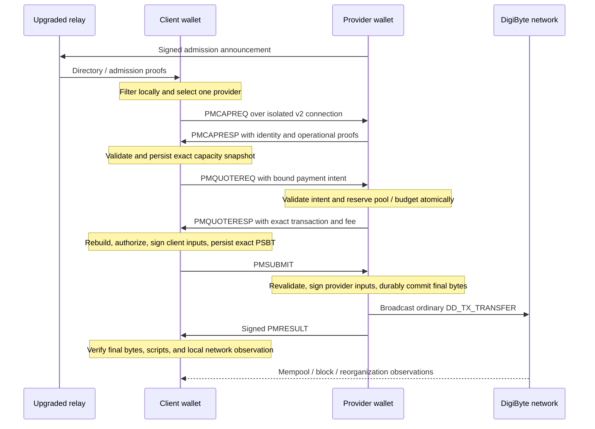

# DigiDollar Paymaster implementation reference

**Source baseline:** `feature/digidollar-paymaster-v1` at `bd270044c1`.
**Documentation review:** 2026-09-11. **Wire protocol:** V5.

This reference describes the inspected implementation and the invariants a
reviewer should check. It is not a new implementation proposal or a claim that
the full release matrix has been rerun. Start with [PAYMASTER.md](../PAYMASTER.md)
for the reading order, branch scope, and commit navigation. The
[release gate](digidollar-paymaster-release-gate.md) records dated test evidence.

## 1. Problem, scope, and participants

DigiDollar outputs carry DD amounts while the miner fee is paid in DGB. The
ordinary send path requires the sender's wallet to fund both. Paymaster adds a
collaborative transfer in which the sender provides DD and a provider supplies
DGB for the fee. Both parties retain their private keys.

| Participant | Responsibility | Authority it does not receive |
|---|---|---|
| Client wallet | Select DD, authorize recipient and fee, validate the entire transaction, sign client inputs, retain recovery state. | No right to spend unreserved provider liquidity. |
| Provider wallet | Prove identity/resources, issue a quote under local budgets, validate client authorization, sign provider inputs, commit and broadcast. | No discretionary custody or signing authority over client DD. |
| Upgraded relay | Relay bounded admission announcements and directory requests. | No payment authorization or privileged consensus role. |
| Existing validator/miner | Validate/mine the ordinary resulting DD transfer. | No requirement to run provider discovery or a Paymaster wallet. |

The supported economic models are `USER_PAID`, public `SPONSORED`, and
restricted `SPONSORED`. Sponsored payments have zero client service fee;
restricted sponsorship additionally requires a payment-bound capability.
There is one recipient per Paymaster session. This path does not sponsor mint
or redemption operations and does not add Paymaster batching to
`sendmanydigidollar`.

## 2. Transaction construction and fee accounting

DD values use integer cents; DGB values use satoshis. For a user-paid offer:

```text
service_fee_cents = ceil(recipient_amount_cents * fee_rate_bps / 10000)
user_DD_in = recipient_DD + user_DD_change + service_fee_DD
provider_DGB_in = provider_DGB_change + miner_fee_DGB
```

The implementation uses checked integer arithmetic and rejects invalid amounts
and rates. Each DD output must remain between 100 and 10,000,000 cents. Inputs
are resolved against their creating transactions and the local UTXO view;
DD inputs must be confirmed. A quote or PSBT cannot substitute its own claimed
prevout values for those checks.

### Why a carrier is needed

A fee below 1 DD cannot be represented as its own DD output. For a positive
fee below 100 cents, the provider contributes a confirmed DD carrier and
receives its principal plus the service fee in a replacement carrier output.

Example: the client has 20.00 DD and no DGB, sends 10.00 DD, and accepts a
50-basis-point offer (0.5%, or 0.05 DD). The provider uses a 1.00 DD carrier.

| Asset | Inputs | Outputs / fee |
|---|---|---|
| DD | Client 20.00 + provider carrier 1.00 = 21.00 DD | Recipient 10.00 + client change 9.95 + provider carrier successor 1.05 = 21.00 DD |
| DGB | Provider fee inputs | Provider DGB change plus the miner fee |

There is no 0.05-DD output. The provider earns 0.05 DD while retaining its
1.00-DD principal. This is a carrier's accounting role; it is not newly minted
DD or an exception to conservation. Zero-fee sponsorship needs no carrier for
an unused service fee. Fees of at least 1 DD can use a normal provider-fee
output, subject to the same output limits.

The builder finalizes all inputs and outputs before signing. Change scripts
are explicit and wallet-owned; the normal collaborative client supplies no
DGB inputs. Inspect [txbuilder.cpp](../src/paymaster/txbuilder.cpp),
[types.cpp](../src/paymaster/types.cpp), and the output-role definitions in
[txbuilder.h](../src/paymaster/txbuilder.h).

### Exact total outflow

`subtract_paymaster_fee_from_amount=true` makes the supplied amount the exact
DD outflow. Core finds a recipient amount whose rounded fee yields exactly
that total, rejecting cent-rounding gaps with `PAYMASTER_NO_EXACT_GROSS_OFFER`.
For example, 50.00 DD at 50 basis points becomes 49.75 DD to the recipient and
0.25 DD fee. `send_all_spendable_dd=true` additionally binds the spendable input
snapshot and rejects a changed balance before reservation. The
[operator guide](digidollar-paymaster.md#exact-total-outflow-and-emptying-a-dd-wallet)
documents the options and exclusions.

## 3. Discovery and payment sequence



This diagram shows logical responsibilities; broadcast completion and result
delivery are not an atomic network operation. A lost result must be recoverable
from the durable provider commit.

1. **Discovery:** `sendpmasters`, `getpmasters`, and `pmannounce` operate on
   upgraded ordinary peers. The directory checks identity and dedicated,
   confirmed admission resources. Admission liquidity is separate from the
   operational pool. Only admission proofs are gossiped.
2. **Selection:** offers are filtered for readiness, amount, funding model,
   authorization, local reputation, privacy, and fee limits. Ranking uses exact
   local totals. Only the selected provider receives operational requests.
3. **Capacity:** before DD outpoints, payment intent, or restricted capability
   are disclosed, V5 authenticates the provider and the exact operational
   resource set. Verify genesis, identity signature, request/session binding,
   nonce, reference block, expiry, BIP86 control proofs, creating transactions,
   and live outpoints. Persist the validated snapshot.
4. **Quote:** the signed intent binds the local order and user input-control
   proofs. The quote must match the selected offer, policy, capacity, recipient,
   fee, change, and complete unsigned transaction. The provider reserves pool
   entries and fee budget atomically.
5. **Client signing:** Core validates its local authorization manifest against
   the trusted template. The client signs only its own DD inputs with
   `SIGHASH_DEFAULT`. The exact signed PSBT and authorization become durable
   before being sent. The high-level call must round-trip the exact
   `authorization_commitment` returned by preparation before a new user
   signature is possible; background work does not replace that acceptance.
6. **Provider signing:** Core rechecks local policy, reservation, template,
   client signatures, and live inputs. It signs only its own inputs and commits
   final raw bytes, result bindings, pool successors, and budget transitions
   before broadcast.
7. **Result:** the client reconstructs the trusted template and verifies txid,
   wtxid, all inputs/outputs and witnesses with actual prevouts. When needed,
   mempool preflight must succeed. An authenticated provider claim alone is
   insufficient to establish confirmation.

The [wire records](../src/paymaster/wire.h),
[protocol records](../src/paymaster/protocol.h), and
[P2P command names](../src/protocol.cpp) define the actual encoding. V5 is
required; there is no downgrade to earlier Paymaster exchanges. Alternative
recovery uses `pmrecreq`, `pmrecresp`, `pmrecsub`, and `pmrecresult` on the
isolated direct connection.

## 4. Authorization and trust boundaries

The local wallet and software are trusted; the remote party may be malicious.
A transport connection does not authorize spending. Each wallet independently
reconstructs the exact transaction and validates local authority immediately
before a new signature.

| Artifact | Binding reviewed before signing or execution |
|---|---|
| `ValidatedCapacitySnapshot` | Authenticated provider and exact operational resources for the selected attempt. |
| `ClientAuthorizationManifest` | Canonical local request, requested fee/privacy/selection modes, provider/offer/policy, capacity, user inputs, recipient/amount, wallet-owned change, fee ceiling, expiry and template. |
| `ProviderAuthorizationManifest` | Validated intent, reserved provider inputs, provider-owned returns/change, exact fees, safety policy, and the precise budget reservation/commit key. |
| `AlternativeRecoveryManifest` | Original session and inputs, distinct recovery provider, wallet-owned DD returns, bounded fee and inherited privacy. |
| Durable provider commit | One exact final raw transaction and corresponding immutable authorization/accounting bindings. |

Unknown PSBT fields, incorrect roles, substituted outputs, and non-default
sighashes are rejected. RPC, GUI, automatic service, retry and recovery share
these checks. New provider signatures require the current safety-policy
binding. An already committed exact transaction retains the historical binding
needed for completion; changing policy does not create new signing authority
or invalidate an otherwise recoverable exact commit.

Signed contradictory capacity or quote claims are stored as local evidence and
block the provider locally. The first valid signed claim is staged as evidence
before deeper validation; it does not itself authorize a spend. Database
failures are kept distinct from invalid remote artifacts so work is not
acknowledged and lost on an unsuccessful persistence operation.

See [psbt.cpp](../src/paymaster/psbt.cpp),
[reservation.h](../src/paymaster/reservation.h), and the
[hardening plan](../DIGIDOLLAR_PAYMASTER_HARDENING_PLAN.md).

## 5. Sessions, retries, and finality

`request_id` is a canonical lowercase UUID bound to a canonical request hash.
Repeating the same request resumes its session; conflicting reuse is rejected.
A session owns its user inputs and can contain separate provider attempts.
An attempt binds one provider, quote, capacity snapshot, and transaction
template. A retry reuses exact persisted artifacts.

| State / phase | Meaning for the caller |
|---|---|
| `CREATED`, `INPUTS_RESERVED` | Request established and inputs protected. |
| `AWAITING_WALLET_UNLOCK`, `AWAITING_USER_SIGNATURE` | The same session awaits local action; neither authorizes provider fallback by itself. |
| `AUTHORIZED`, `PENDING_PROVIDER` | Signed authority may exist; protect inputs and inspect the pending phase. |
| `USER_SIGNATURE_SENT` | The exact client PSBT is durable and may be at the provider. |
| `PROVIDER_SIGNED_KNOWN`, `PENDING_NETWORK` | Provider signing/final commit is known, but network delivery or observation is incomplete. |
| `STEMPOOL`, `MEMPOOL` | Transaction observed in a relay pool, not a confirmed payment. |
| `CANCEL_MEMPOOL` | Recovery transaction is in the mempool; cancellation is still pending. |
| `CONFIRMED`, `CANCELED_SAFE` | Chain-confirmed payment or safe cancellation; chain reconciliation still handles reorganization. |
| `FAILED`, `CONFLICTED` | Inspect the recorded reason and Core-derived allowed actions; do not infer that arbitrary inputs are free. |

These are explanatory groups, not a complete transition table. The exact
session and attempt enums and legal transitions are in
[reservation.h](../src/paymaster/reservation.h) and
[reservation.cpp](../src/paymaster/reservation.cpp). `DGB_COMMITTING` also
exists for the ordinary DGB-funded session path.

`resolvepaymastersession` exposes `refresh`, `retry_same`, `fallback`,
`abandon_unsigned`, and `cancel_to_self`. Mutation must be present in the
current Core-derived `allowed_actions`:

- `fallback` is allowed only **before a user PSBT exists**, preserving the
  reserved DD input set when moving to a new provider attempt.
- `abandon_unsigned` releases only a session for which no transaction
  authorization can exist.
- `retry_same` creates no new quote, attempt, reservation or signature.
- After signing, timeout does not release inputs. `cancel_to_self` prepares or
  resumes one exact same-input return transaction. A distinct eligible
  `USER_PAID` provider can supply DGB when the client has none. Signing requires
  the exact recovery authorization commitment, and cancellation is final only
  after confirmation.

Remote messages cannot undo a final committed authorization. Separately, local
chain reconciliation can roll back a confirmation after a reorganization and
restore pending finance/pool state. This distinction is tested by
[wallet_paymaster_reorg.py](../test/functional/wallet_paymaster_reorg.py).

## 6. Persistence and provider operation

`PaymasterStore` persists sessions, attempts, reservations, manifests, signed
PSBTs, final transactions, budget ledgers, recovery and replay evidence in the
wallet database. Related writes use atomic batches; missing or unreadable
authority cannot be synthesized from a remote message. Records require their
exact current versions. Older experimental Paymaster records fail closed;
ordinary v9.26.5 wallet compatibility does not imply migration of old Paymaster
state.

Confirmation promotes wallet-owned carrier/DGB successors into usable provider
liquidity. Reorganization and conflict reconciliation reverse that availability
when necessary. Optional automatic maintenance tracks pending work and only
fills missing targets. Paid maintenance requires explicit approval and finite
per-transaction/hour/day DGB fee limits. Manual pool operations and withdrawals
bind execution to a preview so a stale plan cannot silently spend different
resources.

Provider operation requires explicit wallet configuration and start. Automatic
queue processing and optional autostart are separate settings. Wallet locking
pauses signing; automatic service does not authorize client payments. Provider
finance records keep DD income, DGB costs, pool principal, and optional oracle
valuation separate. A backup acknowledgement records an operator action, not
proof that a backup is usable.

Eligible completed records are reduced to idempotency tombstones after the
240-block reorganization safety depth. Ambiguous/unconfirmed/unreadable records
are not automatically removed. Wallet encryption protects keys but does not
add field-level encryption to Paymaster metadata and signed artifacts. See the
[retention description](digidollar-paymaster.md#local-metadata-and-retention).

## 7. Runtime and compatibility boundaries

Client/provider readiness requires DigiDollar activation, Paymaster enabled,
an unpruned node, fully synchronized `txindex`, and BIP324 v2. Provider wallets
must be descriptor wallets with local private keys. Relay nodes do not need to
operate such a wallet. `-paymaster=0` disables Paymaster discovery, relay and
client support; provider startup remains explicit with the default enabled.

Standard direct sessions require v2 without v1 fallback. High privacy adds an
onion provider, Tor stream isolation, one provider attempt, and no clearnet
fallback. Readiness also enforces capture/logging restrictions described in the
operator guide. The provider still sees the transaction it co-signs, and the
blockchain remains public.

An old node can validate the final ordinary transfer but cannot relay the
Paymaster discovery protocol. A topology connected only through old peers can
therefore carry normal transactions while Paymaster selection remains
unavailable. The dedicated old-bridge test deliberately injects an announcement
and observes that it is not relayed; this differs from the normal old-leaf test
where Paymaster announcements are not sent to that node.

The overall branch includes arithmetic portability changes in consensus files;
the [branch review note](../PAYMASTER.md#review-the-branch-in-bounded-pieces)
explains why these still require separate equivalence review.

## 8. Source map and RPC entry points

| Area | Start here |
|---|---|
| Arithmetic and deterministic transaction | [types.cpp](../src/paymaster/types.cpp), [txbuilder.cpp](../src/paymaster/txbuilder.cpp) |
| Protocol, PSBT and local authorization | [protocol.cpp](../src/paymaster/protocol.cpp), [psbt.cpp](../src/paymaster/psbt.cpp) |
| Identity, admission and chainstate verification | [directory.cpp](../src/paymaster/directory.cpp), [validation.cpp](../src/paymaster/validation.cpp), [paymasteridentity.cpp](../src/wallet/paymasteridentity.cpp) |
| P2P and bounded work queues | [wire.cpp](../src/paymaster/wire.cpp), [manager.cpp](../src/paymaster/manager.cpp), [net_processing.cpp](../src/net_processing.cpp) |
| Client order and offer selection | [client.cpp](../src/paymaster/client.cpp), [reputation.cpp](../src/paymaster/reputation.cpp), [paymaster_discovery.cpp](../src/wallet/rpc/paymaster_discovery.cpp) |
| Wallet state and atomic commits | [paymasterstore.h](../src/wallet/paymasterstore.h), [paymasterstore_client.cpp](../src/wallet/paymasterstore_client.cpp), [paymasterstore_provider.cpp](../src/wallet/paymasterstore_provider.cpp), [paymasterstore_finalization.cpp](../src/wallet/paymasterstore_finalization.cpp) |
| Recovery, reconciliation and pruning | [recovery.cpp](../src/paymaster/recovery.cpp), [paymasterstore_recovery.cpp](../src/wallet/paymasterstore_recovery.cpp), [paymasterstore_reconciliation.cpp](../src/wallet/paymasterstore_reconciliation.cpp) |
| Provider policies, budgets and liquidity | [provider.cpp](../src/paymaster/provider.cpp), [paymasterprovider.cpp](../src/wallet/paymasterprovider.cpp), [paymaster_provider.cpp](../src/wallet/rpc/paymaster_provider.cpp) |
| Request/submit/result handlers and runtime | [paymaster_processing.cpp](../src/wallet/rpc/paymaster_processing.cpp), [paymaster_runtime.cpp](../src/wallet/rpc/paymaster_runtime.cpp), [paymaster_integration.cpp](../src/wallet/rpc/paymaster_integration.cpp) |
| Wallet signing bridge | [paymasterpsbt.cpp](../src/wallet/paymasterpsbt.cpp), [paymaster_client.cpp](../src/wallet/rpc/paymaster_client.cpp) |
| Existing wallet integration and protection | [digidollarwallet.cpp](../src/wallet/digidollarwallet.cpp), [spend.cpp](../src/wallet/spend.cpp), [load.cpp](../src/wallet/load.cpp) |
| Qt | [digidollarsendwidget.cpp](../src/qt/digidollarsendwidget.cpp), provider widget in [digidollartab.cpp](../src/qt/digidollartab.cpp), [walletmodel.cpp](../src/qt/walletmodel.cpp), [paymasterconfirmation.h](../src/qt/paymasterconfirmation.h) |

The high-level entry is `senddigidollar` in
[src/rpc/digidollar.cpp](../src/rpc/digidollar.cpp); the optional sixth `options`
argument preserves existing five-argument direct-DGB callers. `fee_mode=auto`
falls back only after a concrete insufficient-DGB preflight, not on wallet lock
or unrelated failure. Lower-level quote/PSBT APIs are explicit multi-step
interfaces and do not bypass Core authorization.

| Caller | Principal RPCs |
|---|---|
| Client | `getpaymasteroffers`, `requestpaymasterquote`, `walletprocesspaymasterpsbt`, `submitpaymasterdigidollar`, `getdigidollarsendsession`, `listdigidollarsendsessions`, `resolvepaymastersession` |
| Fee safety | `setpaymasterclientsafetypolicy`, `getpaymasterclientsafetystatus`, `setpaymastersafetypolicy`, `getpaymastersafetystatus` |
| Provider setup/runtime | `createpaymasteridentity`, `setpaymasterpolicy`, `setpaymasterenabled`, `setpaymasterruntimesettings`, `startpaymaster`, `stoppaymaster`, `getpaymasterinfo` |
| Liquidity/finance | `preparepaymasterpool`, `rebalancepaymasterpool`, `setpaymasterliquiditypolicy`, `getpaymasterliquiditystatus`, `withdrawpaymastercarrier`, `getpaymasterfinancestatus`, `acknowledgepaymasterproviderbackup` |

This is a navigation inventory. Exact parameter/result schemas come from the
`RPCHelpMan` definitions and `help <method>` on a binary built from the reviewed
revision. Wallet registration is in [wallet.cpp](../src/wallet/rpc/wallet.cpp);
`listpaymasters` is node-level. Units and examples are in the operator guide.

### High-level payment authorization

For a Paymaster path, `senddigidollar` without `authorization_commitment`
prepares the exact authorization and returns without creating a new user
signature. Once preparation is complete, the caller reviews the provider,
funding model, recipient, amount, fee and returned commitment, then repeats
the same request with that exact commitment. A mismatch is rejected. The
`prepare_only` flag is a compatibility hint; setting it to false cannot bypass
the missing-commitment guard. A headless application must implement this
explicit acceptance step too.

Prepared, authorized and confirmed are different results. Read
`authorization_required`, `authorization_accepted`, the session state and
Core-derived actions; do not treat the first RPC response as a payment receipt.
This does not change the ordinary direct-DGB path. See
[paymaster_discovery.cpp](../src/wallet/rpc/paymaster_discovery.cpp) and the
[operator example](digidollar-paymaster.md#prepare-and-authorize-a-paymaster-payment).

## 9. Changes from the initial design

| Design area | Current behavior / review implication |
|---|---|
| “V1” project label | Refers to the feature milestone; current wire protocol is V5, with individually versioned persistent records. |
| Broad same-input fallback after signing | Ordinary provider fallback stops once a user PSBT exists. Signed ambiguity uses exact retry or explicitly authorized cancellation. |
| General PSBT-based collaboration | Dedicated Paymaster validators, local manifests and role-limited wallet signing enforce the collaborative path. |
| Basic pools and manual processing | Successor reuse, finite automatic liquidity maintenance, finance reporting, runtime modes and explicit autostart are implemented. |
| One high-level automatic send | Paymaster selection/preparation returns an exact authorization commitment; a caller must explicitly round-trip it before a new user signature. |
| Recipient amount plus fee | Optional exact-gross and all-spendable-DD modes now exist with checked cent rounding. |
| Private/temporary protocol state | Durable recovery artifacts and metadata are not field-encrypted; retention must preserve safety and idempotency. |
| Legacy compatibility | Ordinary old wallets/validators and old Paymaster wire/database formats are different compatibility questions; the latter have no implicit migration. |
| Tests and acceptance | The 28 criteria are review identifiers, not a claim of current release approval. Dated local evidence, release-build reruns and external gates remain distinct. |

## 10. Verification map and remaining work

| Concern | Existing verification surface |
|---|---|
| Amounts, carriers, PSBT roles and mutation rejection | `src/test/paymaster_*_tests.cpp`, `src/wallet/test/paymaster_wallet_psbt_tests.cpp` |
| Atomic authority, budgets, failures and restart | `src/wallet/test/paymaster_wallet_store_tests.cpp`, `src/wallet/test/paymaster_wallet_security_tests.cpp` |
| DGB-less payment and sponsored variants | [wallet_paymaster_provider.py](../test/functional/wallet_paymaster_provider.py) |
| Multiple offers and selected-provider-only effects | [wallet_paymaster_offer_selection.py](../test/functional/wallet_paymaster_offer_selection.py) |
| Contention, fallback boundary and single payment | [wallet_paymaster_failover.py](../test/functional/wallet_paymaster_failover.py) |
| Confirmation, finance and pool rollback | [wallet_paymaster_reorg.py](../test/functional/wallet_paymaster_reorg.py) |
| Activation, index and transport prerequisites | [wallet_paymaster_readiness.py](../test/functional/wallet_paymaster_readiness.py) |
| Liquidity, runtime and restart | [wallet_paymaster_lifecycle.py](../test/functional/wallet_paymaster_lifecycle.py), [wallet_paymaster_rpc.py](../test/functional/wallet_paymaster_rpc.py) |
| P2P and old-version compatibility | [p2p_paymaster.py](../test/functional/p2p_paymaster.py), [p2p_paymaster_v9_26_5_bridge.py](../test/functional/p2p_paymaster_v9_26_5_bridge.py), [wallet_v9_26_5_compatibility.py](../test/functional/wallet_v9_26_5_compatibility.py), [wallet_v9_26_5_inplace_upgrade.py](../test/functional/wallet_v9_26_5_inplace_upgrade.py) |
| Qt authorization and displayed state | [digidollarwidgettests.cpp](../src/qt/test/digidollarwidgettests.cpp) |
| Sanitizers and four bounded fuzz targets | [paymaster-security.yml](../.github/workflows/paymaster-security.yml) |

After building the selected revision with wallet support using the repository's
[platform instructions](README.md#building), a focused entry point is:

```sh
./src/test/test_digibyte --run_test=paymaster_types_tests,paymaster_txbuilder_tests,paymaster_psbt_tests --log_level=error --report_level=short
python3 test/functional/test_runner.py --jobs=1 wallet_paymaster_readiness.py wallet_paymaster_provider.py wallet_paymaster_offer_selection.py wallet_paymaster_failover.py wallet_paymaster_reorg.py
```

These commands assume a configured Unix build with binaries in the normal
build paths and the functional runner's generated configuration available.
Use the repository's [functional-test instructions](../test/functional/README.md)
for another build layout. They are review commands, not a claim that they were
run for this documentation update. Full builds, regression suites, fuzzing and
external compatibility environments belong to the agreed release matrix.

Remaining acceptance work is to bind results to an exact release revision and
binaries, rerun affected surfaces after later code changes, complete real-Tor
deployment testing, and obtain or explicitly disposition independent review.
The [release gate](digidollar-paymaster-release-gate.md) is the status record.
