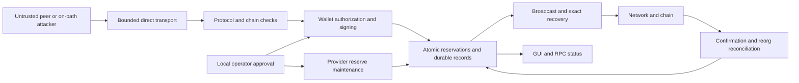

# Paymaster threat model and financial-safety review

## Executive summary

**Review date: 2026-10-10. Three findings reproduced across the initial review
and the provider-backup follow-up:**

- **TM-001 — medium:** provider budget pruning can delete the authorization
  evidence needed to recover an already signed, unconfirmed transaction after
  more than 24 hours. Recovery then fails closed, potentially leaving reserves
  committed and preventing the provider's automatic rebroadcast.
- **TM-002 — medium:** expired, never-signed provider requests retain full session
  and attempt records without an automatic retention bound. Repeated valid
  requests can grow persistent state and the work performed under the wallet lock.
- **TM-003 — high, corrected for explicit GUI/RPC restore:** restoring an older provider wallet renews
  forgotten spending authority. A real SQLite/regtest restore allowed 0.3 DGB
  in confirmed payment fees under a 0.2-DGB daily approval. A second variant
  exposed and re-signed inputs of an earlier signed payment absent from both
  mempools. No direct recipient diversion or DD theft was demonstrated.

The initial TM-001/TM-002 reproductions establish a recovery failure and a
persistent resource-growth path. TM-003 subsequently demonstrated expenditure
beyond an approved fee limit and conflicting provider signing after rollback.
The reviewed signing paths bind amounts, destinations, fees, actual prevouts,
input ownership and transaction signatures independently of transport and peer
claims. The durable restore guard quarantines restored provider wallets before
loading and survives file copying, renaming and restarting. It prevents renewed
authority rather than inventing missing history. Manual replacement with an
older unmarked image or rollback of the whole directory remains undetected.
This is a scoped source review with selected tests, not proof of absence of such
paths or release approval.

Thirty-seven existing protection tests passed **1,130 assertions**. Two isolated
diagnostic cases failed their intended security assertions (**342/344 assertions
passed**), reproducing TM-001 and TM-002. Product code and the normal test suite
were not changed during the initial audit. A subsequent authorized correction
now addresses both findings in source; see the follow-up below. The original
snapshot, diagnostic binaries and reproduction details remain historical evidence.

### Follow-up corrections (2026-10-10)

**TM-001:** the rolling provider ledger still ages expenditure normally. An exact
retained commit and its authorization manifest independently preserve authority
to retry that already signed transaction. Only when the ledger row is absent,
its accounting high-water is more than 24 hours past commit, and the complete
locally stored commit validates may the read-only historical SPENT check use
that evidence. Current RESERVED checks are unchanged. Conflicting existing rows,
missing/corrupt commits and modified finals fail closed. No reservation is
recreated, limit raised, accounting date changed or fee charged again. Normal
provider recovery and idempotent final commits use this path; alternative-provider
final-commit retries also retain their exact local commit binding. This reuses
existing records and needs no database-format migration or duplicate journal.

**TM-002:** periodic/tip reconciliation now removes eligible FAILED provider
sessions and QUOTE_EXPIRED attempts after both their terminal timestamp and
complete retry/capacity expiry have passed the 24-hour replay-retention window.
It validates every referenced record/index, rejects signatures, accepted
authorizations, commits/results, recovery records and remaining budget/pool
bindings, then erases full artifacts and indices atomically. Historical
capability-bound requests are retained without blocking maintenance or consuming
the cleanup quota.
No permanent tombstone is created for these expired unsigned remote requests:
the old signed envelopes are expired and cannot authorize a replay. Signed,
ambiguous and confirmed-payment retention stays unchanged.

Cleanup is limited to 64 eligible sessions per pass. New quote preflight and
atomic admission stop at 8,192 retained provider sessions per wallet; existing
requests can continue. The quota prevents unbounded accumulation even when
maintenance is delayed. Existing backlogs drain over multiple passes. This is
a count/retention bound, not a measured throughput or latency guarantee.

Two new tests and an extended durable-commit test pass **3 cases / 8,539
assertions**. The related selection, including those cases, passes **48 cases /
10,012 assertions**. The quota test accounts for 8,197 assertions, mostly fixture
inserts at the actual limit. Tests cover the 24-hour boundary, policy changes,
restart, no additional spending/write on exact retry, corrupt/conflicting
authority, unsigned pruning boundaries, signed/budget protection, transaction
begin/commit failure rollback, index removal and expired replay rejection.
Historical restricted retention is checked without re-enabling that mode.

Seven selected translation units were compiled and linked into a new isolated
test executable. Sources, binary/report hashes and exact filters are recorded
under `build_msvc/paymaster-refresh-check/security-fixes/`. Normal product
executables were not rebuilt or replaced. Fresh full product/functional,
sanitizer/fuzz, physical SQLite storage-failure and independent review gates
remain open. The real engine-level SQLite follow-up and the stale-provider
explicit-restore gate are documented below. The threat table describes the initial attack
assessment; TM-001 and TM-002 now have source corrections with this targeted
verification, rather than unresolved implementations.

## Scope and assumptions

The operator confirmed a public provider accepting arbitrary counterparties,
with local GUI/RPC administration and a trusted operating system on the honest
side. Either the client or provider can be malicious. An on-path attacker may
observe, relay, suppress, reorder or replace transport messages. Existing
control of the honest party's OS/private keys is excluded; obtaining such
control through a Paymaster defect remains in scope.

Reviewed: `src/paymaster/`, Paymaster wallet/store/RPC code, relevant networking,
transaction construction/signing, Qt confirmation, persistence and test paths.
Original DigiDollar validation was inspected where a Paymaster claim depends on
it. This is not a full consensus, cryptographic-library, compiler, dependency or
operating-system audit. Restricted sponsorship is disabled in the current user
interfaces; retained future-extension code is not evidence of a publicly usable
voucher feature.

Deployment details still affecting residual risk are the expected sustained
request rate/storage budget, manual provider-file/directory rollback outside the explicit restore API, and whether confidentiality against an active transport relay is required. No positive assumptions about those guarantees were used.

The audit includes the uncommitted worktree, including the previous client
recovery fee-reservation correction. It is **not** a review of HEAD alone:

| Item | Recorded value |
|---|---|
| Branch | `integration/paymaster-v9.26.7` |
| HEAD | `d377b7683b22e9ba8618471bd5d8be812d0dab4d` |
| Initial snapshot UTC | `2026-10-10T11:34:43.3734476Z` |
| Worktree diff SHA256 | `bd18c19b48b81c912676d2bb67c1c04a07f5abd264df99f3294b26c1e90554c6` |
| Probe executable SHA256 | `d0a17755d5fe68876d5f6c618d27e32333388ffa8d253766fdd96ec28a3ecf82` |
| Existing-guard executable SHA256 | `972e8df9d6ef5b463c0c7eab1c6704b338ad12956fea826a860983cd29f1a10c` |

Workspace-local evidence is in
`build_msvc/paymaster-refresh-check/security-audit-20261010-133443/`:
`source-before.diff`, `source-receipt.json` (117 relevant file hashes),
`results.json`, the probe sources/response files, and test logs/reports.
All 117 hashed source files remained unchanged during the audit. The six source
hashes, binary and reports in the preceding `reorg-fee-fix/results.json` also
still match. The diff hash predates this report and its documentation links.
These local build artifacts are ignored by Git; preserve them with the review.

Validation used a newly compiled diagnostic test translation unit linked with
existing operator-built libraries and the latest isolated Paymaster store
objects. Existing guards used the preceding isolated recovery-fee executable.
This is **not a clean full rebuild** of every translation unit. Historical
operator results and earlier functional runs have their own source/binary scope
in the [test runbook](digidollar-paymaster-testing.md); they are not new passes
of the complete current worktree.

Guidance applied: repository and `src/` AGENTS instructions, `CLAUDE.md`,
`CONTRIBUTING.md`, architecture/repository maps, developer notes, formatting and
test guidance; the DigiDollar/oracle baseline; and the Paymaster implementation,
hardening, integration, operator and testing documents. The review follows the
`security-threat-model` skill. Heavy builds/campaigns remain operator tasks.

## System model

### Primary components

The runtime is native C++: a daemon/wallet RPC service or Qt desktop application,
with a CLI RPC client. Python drives functional tests. MSVC and autotools builds
produce the daemon, GUI, CLI and test executables. CI runs separate sanitizer
and fuzz builds; those checks do not grant runtime payment authority. Dependency
and build-system compromise were not audited here.

1. Discovery and direct transport advertise provider identity, policy and
   capacity; dedicated BIP324 V2 channels route wallet-scoped messages.
2. Protocol, transaction-builder and PSBT validators turn untrusted offers into
   exact locally checked transactions and immutable authorization manifests.
3. Wallet RPC/store code owns signing, concurrent reservations, durable commits,
   finance records and restart/reorganization recovery.
4. Provider maintenance prepares, recycles, withdraws and retires wallet-owned
   capital under separately approved limits.
5. GUI/CLI expose the same wallet authority. A successful RPC response, signed
   peer reply or green GUI status is not independent proof of chain confirmation.

### Data flows and trust boundaries

- **Network → manager:** bounded messages, negotiated version/activation,
  direction, wallet route and admission checks precede processing.
- **Peer artifacts → signer:** signed intent/quote/capacity data still require
  local prevout, amount, output, ownership and witness validation.
- **Local approval → durable authority:** the exact selected transaction and
  finite budgets must survive concurrent RPCs and crashes unchanged.
- **Wallet database → recovery:** retained signed artifacts and accounting
  evidence must remain consistent across time, restart and reorganization.
- **Chain → wallet:** local exact transaction/witness and confirmation evidence
  supersede peer status strings. A timeout does not invalidate a signature.
- **Untrusted text → GUI/logs:** display must not execute input or misrepresent
  financial authority; sensitive transaction artifacts need separate handling.

### Diagram



## Assets and security objectives

| Asset | Required property |
|---|---|
| Client DD and DGB | Only approved recipients, amounts and fees; exact own change; no other wallet inputs signed. |
| Provider capital and income | Only approved fee contribution and return scripts; no concurrent overbooking or unsafe reserve release. |
| Private keys | No remote key exposure or code execution; only the selected input role is signed. |
| Fee approvals | Absolute, percentage and rolling limits bind actual amounts; retries and policy changes cannot create new authority. |
| Signed inputs | Remain protected while either original or recovery transaction can still win. |
| Durable state | Crash-safe, idempotent reconstruction; adequate replay and reorg evidence retained. |
| Availability and privacy | Bounded network and persistent work; clear distinction between availability, payment success and confidentiality. |

## Attacker model

### Capabilities

The attacker can operate many peers/clients, own valid DD/DGB inputs, sign its
own protocol artifacts, offer deceptive prices, request/cancel/abandon quotes,
withhold signatures or final transactions, reconnect, replay messages and
choose adverse timing. It can exploit chain delays and reorganizations within
the node's actual chain rules. A local RPC principal may exercise its granted
methods; method/wallet separation must remain enforced.

### Non-capabilities

The attacker cannot forge the honest wallet's valid Schnorr signatures, rewrite
the honest node's chainstate at will, directly edit its database or use its
admin cookie under these assumptions. A provider's identity signature proves
control of that identity, not honesty. Public sponsorship deliberately permits
eligible strangers to consume an approved finite subsidy budget.

## Entry points and attack surfaces

| Surface | Processing and relevant evidence |
|---|---|
| Discovery/capacity/direct messages | `net_processing.cpp:4260–4500`; `paymaster/wire.{h,cpp}`, `manager.cpp`, `validation.cpp`: version/size/direction, replay, chain-backed capacity, queues. |
| Quote and user/provider PSBT | `paymaster/protocol.cpp`, `txbuilder.cpp`, `psbt.cpp`; `wallet/paymasterpsbt.cpp`: exact template, manifest, actual prevouts and selective signing. |
| Send/accept/submit and recovery RPC | `wallet/rpc/paymaster_client.cpp`, `paymaster_processing.cpp`, `paymaster_send.cpp`; store transactions: approval before signature/exposure. |
| Provider setup/refill/withdraw/release | `wallet/paymasterprovider.cpp`, `wallet/rpc/paymaster_provider.cpp`: finite maintenance authority, owned confirmed inputs and busy-state checks. |
| Wallet records and restart | `wallet/paymasterstore*.cpp`, `walletdb.cpp`: typed records, atomic writes, exact durable recovery and protected bindings. |
| GUI/CLI and authenticated RPC | `qt/paymasterconfirmation.h`, `paymastersendwidget.cpp`, `paymaster/cli.cpp`; RPC authorization test in `wallet_paymaster_rpc.py`. |
| Parser/fuzz inputs | `paymaster_wire_envelopes`, `paymaster_stateful_security`, `paymaster_pool_lifecycle`, `paymaster_persistence_records`; current sanitizer campaigns not executed here. |

Line references below describe the hashed worktree; symbols remain the primary
navigation anchors when subsequent edits move lines.

## Top abuse paths

1. **Tamper with the transfer:** substitute recipient/change or fee while
   relaying a genuine provider identity. Exact manifests, template equality,
   actual prevout checks and full-input signatures reject the modified spend.
2. **Replay authority across contexts:** move a valid quote/submit into another
   session, provider, wallet route or network. Bound identifiers, genesis,
   capacity nonce, immutable request and wallet-specific ownership checks
   reject the substitution; transport encryption alone is insufficient.
3. **Race approvals or manipulate pricing:** concurrent requests try to consume
   the last budget/pool slot or exploit fee rounding. Integer limits and atomic
   reservations defend the tested cases; explicitly approved expensive offers
   remain possible within the limits.
4. **Withhold a signed payment:** an attacker retains a usable signature while
   the honest party times out or restarts. Same-input recovery and durable
   reservations prevent timeout-based reuse. TM-001 can additionally break the
   provider's own recovery once its evidence is pruned.
5. **Accumulate unpaid abandoned quotes:** request a valid quote, never sign,
   wait for expiry and repeat with fresh request IDs. TM-002 retains the full
   historical records despite releasing current capacity.
6. **Exploit restored history:** after an operator restores an old provider
   backup, exploit forgotten spending/reservations. TM-003 reproduced both renewed expenditure and conflicting signing. Explicit GUI/RPC restore now persists a quarantine before wallet loading. Manual copying of an old wallet or entire data directory still requires an independent monotonic checkpoint to detect rollback.
7. **Interrupt durable transitions:** terminate processes or provoke storage
   failure between signature, commit and broadcast. Existing injected-failure
   tests cover important transitions; real disk-full/power-loss behavior remains
   unverified for this source/build.
8. **Inject or exhaust resources:** malformed/oversized wire records, displayed
   text, repeated valid subsidy requests or an active transport relay target
   parsing, privacy and availability. Bounds and text escaping are defenses;
   persistent retention, public subsidy consumption and sanitizer gaps remain
   distinct concerns.

## Threat model table

Priority for an open question is its investigation priority, not a claim that
an exploit has been confirmed.

| ID / status | Threat source, prerequisites and action | Impact / assets | Existing controls and evidence | Gap, mitigation and detection | Likelihood / severity / priority |
|---|---|---|---|---|---|
| TM-001 **confirmed** | Delayed/withheld final outcome; provider signed commit survives >24 h; subsequent ledger pruning removes its SPENT row. | Failed recovery; committed DD/DGB may remain bound. No theft/extra fee shown. | Exact final validation and budget firewall reject missing authority; probe reproduces rejection. | Retain authorization provenance independently of rolling accounting. Detect missing-row errors for retained commits. | Medium / medium / **medium** |
| TM-002 **confirmed** | Valid public client repeatedly creates unique quotes and lets unsigned requests expire. | Persistent database growth and increasing wallet-lock work; indirect recovery delays. | Short quote life, input control proofs, active/rate limits and capacity replay cleanup. | No automatic bound on full expired session/attempt history. Compact only provably unsigned terminal records; monitor counts, disk and reconciliation latency. | Medium / medium / **medium** |
| TM-003 **explicit restore corrected** | Operator restores stale provider backup; counterparties continue payment requests or retain an unpublished signed payment. | Before correction: confirmed 0.3-DGB fees under a 0.2-DGB allowance and conflicting provider signing. | Durable `pmrestoreguard` precedes wallet load; readiness, start, identity/transaction signing, quote admission and reserve actions fail closed. Exact known commits still replay. Both real SQLite/regtest variants pass. | No automatic history reconstruction or guard-clear API. Manual file/directory rollback cannot be detected from its own old contents; an independent checkpoint and physical storage-failure tests remain open. | Conditional on restore / high pre-fix / manual rollback residual |
| TM-004 **defended integrity; privacy residual** | Active MITM terminates two transports and relays authentic Paymaster artifacts. | Can observe forwarded metadata or delay service; no modified spend demonstrated. | Identity/quote/capacity signatures and independent PSBT checks; V2 required. | No provider-authenticated transport transcript binding found. If active-MITM confidentiality is required, design explicit channel binding and test a relay. | Medium / low financial severity / **low** |
| TM-005 **defended in selected tests** | Malicious party changes outputs, model, fee, inputs or signature mode; races last budget/slot. | Attempted theft or fee-cap bypass. | Exact manifests, SIGHASH_DEFAULT/witness verification, role ownership, chain UTXOs, atomic budget/pool checks. | No bypass reproduced; preserve tests on every signing/recovery route and fresh builds. Monitor validation rejections without logging full artifacts. | Low residual / high if bypassed / **low** residual |
| TM-006 **defended within retention horizon** | Lost reply, late final, cross-session replay, shallow reorg or old client fee rows after self-recovery. | Attempted double authorization/fee exposure or unsafe input reuse. | Durable exact commits; same-input conflicts; corrected client fee retention/repair; five related cases rerun. | No new bypass found. Reorgs beyond pruned 240-block history remain outside this reconstruction guarantee. Monitor unresolved liabilities. | Low residual / high if bypassed / **medium** continued verification |
| TM-007 **open physical verification** | Process/storage failure at commit/broadcast boundary. | Lost authority, unavailable wallet or incorrect fee recovery if durability fails. | Atomic transactions, simulated begin/write/commit failures and lifecycle restarts; real SQLite page-cap `SQLITE_FULL` and connection-local commit-denial tests now verify unchanged records, close/reopen, restore quarantine and exact retry. | Physical ENOSPC, failed writes/fsync, torn writes and power loss remain untested. Use isolated filesystems/VMs, assert exact authority before publication and once-only accounting. | Unestablished physical durability / potentially high / **high** verification priority |
| TM-008 **expected budget use** | Many eligible public-sponsored clients consume the approved subsidy. | Intentional bounded DGB expenditure and capacity exhaustion, rather than unauthorized theft. | Per-transfer/hour/day, recipient/netgroup and concurrent admission controls. | Sybil resistance is not guaranteed. Keep public budgets deliberately finite; monitor remaining allowance and request concentration. | High if targeted / bounded by approvals / **medium** operational |
| TM-009 **no injection confirmed; test gap** | Arbitrary peer fields reach decoders, database, logs or display. | Parser crash/resource exhaustion; key compromise would be severe if memory corruption exists. | Wire/PSBT/count limits, typed DB records, structured RPC, plain/escaped UI text; selected malformed-input tests pass. | No executable/SQL injection path identified. Current sanitizer/fuzz and sustained-load runs remain open; TM-002 is a concrete cumulative-storage exception. | Unestablished residual / potentially high / **medium** verification |

### TM-001: retained provider commit loses its budget authority

**Reachable path.** `PruneProviderLedger` in
[`src/paymaster/provider.cpp`](../src/paymaster/provider.cpp) (76–84) removes any
non-RESERVED reservation older than `SAFETY_DAY_SECONDS`, including SPENT rows.
`ReserveProviderBudget` calls it at about line 946 when admitting subsequent
work. Other accounting/admission paths also invoke this helper. Its arguments
contain no information about still-unconfirmed durable commits.

`ValidateProviderBudgetState` in
[`src/wallet/paymasterstore.cpp`](../src/wallet/paymasterstore.cpp) (428–452)
requires the exact `commit_key` row. `RecoverDurablePaymasterCommit` in
[`src/wallet/paymasterprovider.cpp`](../src/wallet/paymasterprovider.cpp)
(873–900) requires that row to be SPENT before executing the retained final.
`allow_historical_policy=true` does not permit a missing row. The signature can
remain executable after expiry: `ValidateProviderCommitForExecution` in
`paymaster/psbt.cpp` handles that case deliberately. Generic wallet rebroadcast
excludes Paymaster durable commits (`wallet/wallet.cpp`, approximately
2500–2520), so it does not remove this dependency.

**Reproduction.** The diagnostic copy of
`provider_final_commit_spends_budget_atomically` creates a genuine signed final
using `PaymasterMempoolTestingSetup`; the ordinary initial recovery succeeds.
At `commit.committed_at + 86401`, production `ReserveProviderBudget` admits a
different operation and removes the first SPENT row. Persist that ledger and
call `RecoverDurablePaymasterCommit` on the original retained commit:

```text
TM-001 recovery after ledger aging: error=PAYMASTER_BUDGET_RESERVATION_MISSING
audit_pending_commit_budget_aging: 273 passed assertions, 1 failed assertion
```

The diagnostic does not delete the row by hand. It exercises the production
pruning function and actual recovery validator. The first transaction remains
unconfirmed in the test mempool; mempool eviction and a real multi-day outage
were not simulated. The result proves rejection of valid retained authority,
not inevitable loss of every old transfer or a full live-node outage.

**Financial distinction.** No new spend is authorized by this failure. The
provider refuses recovery while its durable signature and COMMITTED pool
binding remain. Another holder may still broadcast that transaction. Manually
releasing those inputs would be an unsafe workaround.

**Proposed correction.** Separate rolling-window expenditure from immutable
authorization evidence. Keep a bounded authorization record for each unresolved
durable commit, even after its expenditure ages out of the daily window. Prune
it only with safe commit/session finalization. When retention capacity is full,
refuse new admission rather than delete live authority. A migration for an
already missing row must derive evidence only from complete, locally verified
durable records, preserve original accounting dates and avoid charging twice.
Do not simply remove the recovery budget check or count all old costs forever.

**Acceptance tests.** More than 24 h plus unrelated admission; restart and
mempool eviction; delayed original broadcast; alternate-provider final;
confirmed/pruned cleanup; ledger-cap backpressure; malformed/missing evidence;
exactly-once finance; hour/day budgets still age normally.

### TM-002: abandoned unsigned provider quotes retain full records

**Reachable path.** `CommitProviderQuote` in
[`src/wallet/paymasterstore_provider.cpp`](../src/wallet/paymasterstore_provider.cpp)
persists a session and an attempt containing full request/quote/PSBT artifacts.
`ExpireProviderQuotes` (starting near 1568; provider branch near 1760–1890)
releases definitively unsigned pool/budget reservations and writes
`QUOTE_EXPIRED` / `FAILED`. It does not compact their history.

`ReconcileFinalSessionsAtTip` in
[`src/wallet/paymasterstore_reconciliation.cpp`](../src/wallet/paymasterstore_reconciliation.cpp)
calls expiration and scans the sessions again, but skips FAILED records near
line 861. The production caller of `PruneFinalSession` near line 787 is reached
through sufficiently confirmed final transactions. No automatic expiration or
total retained-record quota was found for this unsigned terminal history.
Runtime reconciliation runs periodically via `wallet/rpc/paymaster_integration.cpp`.
These scans acquire the wallet lock.

**Important existing defense.** `ExpireProviderCapacityReservations` does clean
capacity response/nonce/session indices after `CAPACITY_REPLAY_RETENTION`.
This finding concerns the separate full payment sessions/attempts; it does not
claim that all capacity replay records live forever.

**Reproduction.** The diagnostic copy of
`provider_quote_commit_is_atomic_and_restart_durable` persists a valid quote,
expires it at `now + 61` and runs `ReconcileFinalSessionsAtTip` at `now + 7 days`:

```text
TM-002 seven days later: sessions=1 full_attempt=true quote_bytes=750 psbt_bytes=355
audit_expired_quote_retention: 69 passed assertions, 1 failed assertion
```

Seven days is a diagnostic observation point, not a documented cleanup deadline.
The static call path establishes the missing automatic bound. The two byte
counts are only selected artifacts in the small fixture, not total storage per
attack request. No high-volume benchmark, disk exhaustion or live service
denial was performed.

**Attacker prerequisites and cost.** A reachable provider, valid client input
control proof, eligible amount and available quote capacity are required.
The client can reuse an unspent controlled DD input after unsigned expiry,
using fresh requests. There is no successful payment/miner fee for the abandoned
quotes. Active-slot and request-rate limits slow accumulation, but do not bound
the lifetime number of retained full records.

**Proposed correction.** Add Paymaster-specific terminal-record compaction after
the applicable retry/replay window. First prove the absence of accepted user or
provider signatures, authorization, durable commit and protected reservation.
Atomically remove full artifacts and indices while retaining only the minimum
bounded replay tombstone required by the protocol. Never use a timeout to prune
signed or ambiguous work. Add a persisted-history quota/backpressure mechanism
and operator metrics for retained records/reconciliation latency.

**Acceptance tests.** Many unique valid unsigned expiries with bounded retained
bytes/counts and released capital; restart during compaction; stale message
replay; begin/write/commit failures; signed/ambiguous sessions remain intact;
independent wallets remain isolated. Measure wallet-lock time under sustained
admission before claiming a production capacity limit.

### TM-003: stale provider restore forgets expenditure and signed inputs

**Status: corrected for explicit GUI/RPC wallet restoration; targeted tests pass.**
The fix conservatively blocks new authority. It does not reconstruct financial
records missing from a backup or establish that an unpublished signature is gone.

**Prerequisite and original reproduction.** An operator restores an old provider
backup. Public counterparties cannot invoke this local RPC themselves. Two real
payments each cost 0.1 DGB under an unchanged 0.2-DGB rolling-hour/day approval
and two-payment count limit. A pre-payment SQLite backup previously autostarted
ready, signed a third payment, and all three confirmed (0.3 DGB total). A second
variant restores after the first confirmation but before the second signed final,
with the final absent from both mempools. It previously exposed and re-signed an
input of that withheld transaction. Competing spends cannot both settle; this
variant proves conflicting authority, not an extra confirmed 0.3-DGB charge.

**Implemented protection.** `RestoreWallet` in
[`wallet.cpp`](../src/wallet/wallet.cpp) opens only the copied database and calls
`MarkPaymasterProviderRestored` before `LoadWallet`, its callbacks, or autostart.
The Paymaster helper and guard checks live in
[`paymasteridentity.cpp`](../src/wallet/paymasteridentity.cpp), with codecs in
[`paymasterdb.cpp`](../src/wallet/paymasterdb.cpp). The optional wallet record
`pmrestoreguard` reuses the versioned provider-identity codec and is append-only.
Marker creation must commit successfully or restoration fails before loading.
Missing identity means a client-only backup is unchanged; malformed identities
are rejected. Malformed/unsupported markers fail closed and cannot be overwritten
by the helper. The base wallet schema and Paymaster wire protocol are unchanged.

The guard disables model availability/readiness, manual/automatic starts,
identity-key access for announcements/capacity/quotes, store admission and both
ordinary/alternative-provider pre-signature checks. The role-limited wallet
signer checks it again for PROVIDER inputs. Manual reserve preparation,
withdrawals, retirement and capital release, both automatic refill builders,
and recurring preparation cannot create fresh spending authority. Changes to
settings, approved limits, backup reminders, or the clock do not clear it.
GUI diagnostics explain the missing-history risk without putting the internal
error token in the main instruction text; RPC/CLI use
`PAYMASTER_PROVIDER_RESTORE_REVIEW_REQUIRED`.

Exact, already persisted fully signed commits can still be validated and
replayed without new signatures. Lost templates cannot be reconstructed from
untrusted replay data. This distinction is verified with actual retained and
lost payments, not just mocked readiness flags.

**Verification.** [`wallet_paymaster_backup.py`](../test/functional/wallet_paymaster_backup.py)
uses only disposable descriptor SQLite wallets and two regtest nodes. Both
variants pass with restored autostart/manual start blocked, exact retained
commit replay unchanged, RPC and real CLI reserve actions rejected, no mempool
change, and the guard surviving enable/disable, safety-policy saves, backup
acknowledgement and automatic runtime selection. Client-only backup restoration
preserves DD funds and its fee policy without a provider quarantine.

Three additional wallet unit cases cover restart, append-only/idempotent marker
creation, write/commit failure rollback, malformed/future layouts and the shared
signing/refill boundaries. The focused security suite, existing PSBT suite and
backup-metadata case pass. The GUI regression checks the readable instruction
in light and dark themes. Source, object and binary hashes and per-run reports
are tied to 22 passing unit cases / 9,348 assertions, both passing real backup
variants and the targeted Qt check. Verification inputs and outputs
are recorded in the workspace-local
`build_msvc/paymaster-refresh-check/provider-backup-fix/run-receipt.json`.
This is a selected-object MSVC build linked with existing Release dependencies;
it is not a fresh full build or cross-platform/sanitizer approval. Normal product
executables were not replaced. Pre-fix proof remains in
`build_msvc/paymaster-refresh-check/provider-backup/run-receipt.json` and its
visible/offline observations; those failing runs are historical evidence.

**Residual scope and availability cost.** No guard-clear RPC is provided: an
acknowledgement, a rescan, waiting 24 hours, or increasing limits cannot prove
that an omitted signature is harmless. Continue service from the complete,
current original provider wallet, not the quarantined image. If that source is
lost, comprehensive history reconciliation/safe migration is still required;
new provider activity and reserve release remain blocked. Pool entries in an
old image may look locally unspent, but they confer no provider authority while
the guard is active. Ordinary wallet key ownership is unchanged; this is not an
OS-wide prohibition on spending a restored wallet.

Copying a wallet that already contains the guard preserves quarantine, even
under a different wallet name and after a node restart. Both real backup
variants also exercise this file-copy/load path through RPC and CLI. In contrast,
manually replacing a wallet with an older **unmarked** image, or rolling back
the entire data directory to such an image, bypasses the explicit restore hook.
The new checks are not active just because the executable contains them: they
need the durable marker. This is a real remaining risk of renewed approval or
conflicting signing, not an attack available to a peer without local rollback.

Detecting unmarked rollback requires trustworthy state outside the rolled-back
data. A future checkpoint must bind the network and persistent provider identity
to a monotonically advancing financial generation; commit it durably before
publishing each new signature or reserve-spending authority. A mismatch, a
missing established checkpoint or a write failure must block new authority.
Crash ordering must fail closed, and known exact recovery must not advance or
clear the checkpoint. Wallet renaming and configuration/backup acknowledgement
must not reset it. Initial registration of an existing provider requires a
trusted complete current wallet; the first registration cannot retroactively
prove that an already copied file is current. A checkpoint inside the node data
directory only detects wallet-only rollback if that directory survives; restoring
both requires an independently retained checkpoint. Timestamps, a rescan and
mempool absence are not substitutes. This mechanism is **not implemented**;
do not describe the explicit restore correction as safe recovery from every
old backup. Real disk-full/power-loss durability also remains open.

## Criticality calibration

Direct unauthorized signature, recipient diversion, approval bypass or key
extraction would be high/critical. TM-003 reproduces approval bypass following
local backup restoration and has high correction priority. Medium here means an
attacker-reachable or operationally reachable state/liveness defect with a
concrete failed invariant. TM-002's eventual outage size/rate is not measured.

| Consequence | Result of this review |
|---|---|
| DD/DGB theft or unauthorized principal diversion | No additional confirmed path; exact signing guards passed the selected tests. |
| Exceeding approved service/network fees | TM-003 confirmed provider network-fee overspend following stale restore. Client service-fee bypass was not demonstrated. |
| Bound or inaccessible capital | TM-003 conflicting signing after loss of a pending final; TM-001 initial recovery rejection. Adversarial withholding can also legitimately require same-input recovery/confirmation. |
| Operating disruption | TM-002 confirmed retained-state growth; resulting disk/latency limits unmeasured. Public subsidy exhaustion is separately expected within approval. |

### Attacks examined and stopped by existing controls

- **Recipient/change/input substitution and weak signatures:** manifest equality,
  independent actual-prevout checks, full-template comparisons, default sighash
  and cryptographic witness verification in `psbt.cpp` plus ownership and
  selective-role checks in `wallet/paymasterpsbt.cpp`. A wallet owning both roles
  does not automatically sign the unrequested role.
- **Stale or forged liquidity:** capacity proofs are checked against local chain
  state, reference block, current UTXOs and input control. Provider pre-sign
  firewalls reload pool/budget/capacity rather than trusting an earlier preview.
- **Excess/rounded fees:** DD cents and DGB satoshis use checked arithmetic;
  percentage caps use actual recipient amounts. The suspected omission of DGB
  on DD inputs does not give a spend bypass: DD extraction requires the DD
  output's native value to be zero in `digidollar/validation.cpp`.
- **Parallel budget/pool consumption:** wallet locking and atomic store
  transactions protect the last available budget or pool slot. Repeated exact
  results do not imply another payment authorization.
- **Timeout/backup/reorg misuse of client fee release:** the current repair
  checks retained local authorization and signed artifacts, keeps unresolved
  liabilities, preserves SPENT dates and current limits, and runs before new
  approval. Invalid evidence fails closed. The 240-block retention horizon is
  preserved; already-pruned history cannot be reconstructed by this helper.
- **Recovery redirection:** alternative recovery binds the original inputs,
  provider, fresh owned returns, fees, manifest and final witnesses. Provider
  recovery also rechecks its own budget/pool authority. Same-input recovery
  cannot revoke another valid transaction merely by elapsed time.
- **Automatic repricing in GUI/CLI:** exact confirmation fields and authorization
  commitment are rechecked in `qt/paymasterconfirmation.h` and send/recovery
  paths. Structured CLI/RPC arguments do not invoke a shell. A changed preview
  is not a new financial approval.
- **Obvious injection:** searches and traced display/storage paths found no
  Paymaster shell/SQL concatenation execution sink. Typed database APIs and
  plain-text/escaped dynamic GUI fields are defenses. SQLite trace handling
  avoids expanded bound values on writes. This is not proof of C++ memory safety
  or a complete Qt widget audit.
- **RPC/wallet confusion:** local authentication/whitelists, selected wallet
  routing, per-wallet stores and ownership checks are relevant controls.
  `wallet_paymaster_rpc.py` contains denied-method and mixed-batch permission
  cases, but that functional script was not rerun for this audit.

## Focus paths for security review

| Path | Next review focus |
|---|---|
| `src/paymaster/provider.cpp` | TM-001 lifetime separation; quota/window arithmetic and concurrent reservations. |
| `src/wallet/paymasterstore.cpp` | Provider budget binding and durable provenance validation. |
| `src/wallet/paymasterstore_provider.cpp` | TM-002 unsigned expiry and atomic quote admission. |
| `src/wallet/paymasterstore_reconciliation.cpp` | Safe pruning, client fee repair and deep-reorg limits. |
| `src/wallet/paymasterstore_finalization.cpp` | Signature → commit → publication ordering; once-only finance. |
| `src/wallet/paymasterstore_recovery.cpp` | Original/recovery competing authority and current fee limits. |
| `src/wallet/paymasterprovider.cpp` | Durable recovery, restored provider accounting, maintenance and retirement. |
| `src/paymaster/psbt.cpp` and `src/wallet/paymasterpsbt.cpp` | Exact template/witness/ownership on every signer path. |
| `src/paymaster/recovery.cpp` | Alternate-provider output/input/fee bindings. |
| `src/paymaster/wire.cpp` and `src/net_processing.cpp` | Parser and direction/version bounds; MITM/channel binding. |
| `src/paymaster/manager.cpp` and `transport.h` | Admission/queue bounds, replay and wallet route isolation. |
| `src/wallet/rpc/paymaster_client.cpp`, `paymaster_processing.cpp` | Concurrent approval/sign/retry and restored-state handling. |
| `src/qt/paymasterconfirmation.h`, `paymastersendwidget.cpp` | Immutable user intent through delayed replies and wallet changes. |
| `test/functional/wallet_paymaster_lifecycle.py`, `wallet_paymaster_reorg.py` | Extend real-database backup/failure/reorg coverage. |

## Notes on use

### Verification performed

| Check | Result and scope |
|---|---|
| TM-001/TM-002 isolated diagnostics | 2 intended failures, 342 passed / 2 failed assertions; Boost exit 201. No normal product or tracked test source replacement. |
| Protocol (4), PSBT (3), wire (5), transport (3), recovery (5) | 20 selected existing cases passed. |
| Wallet PSBT (3), wallet security (5), provider limits (4), wallet store (5) | 17 selected existing cases passed. Total across both rows: **37 cases, 1,130 assertions**, exit 0. |
| Prior recovery-fee evidence | Matching source/binary/report hashes; five repaired store cases included in today's selected run. Earlier 28-case result not counted as 28 new tests. |
| Normal full product/Qt build, full functional matrix, sanitizer/fuzz, live MITM/load and real storage failures | **Not run in this audit.** |

The exact 37-case selection is in local `guard-filter.txt` and `results.json`;
there are 4,094 registered cases in that executable, of which 4,057 were skipped.
Do not interpret its overall executable as a full-suite pass.

The probe preparation script `prepare-probes.py` generates a copy of the existing
wallet-security fixtures and inserts the two diagnostic blocks. Its local
`audit.rsp` and `audit-link.rsp` record selected compilation/link inputs. They
depend on the existing MSVC build artifacts. The generated copy and executable
are reproducible local evidence, not newly passing regressions in the default
suite. Promote the probes into ordinary passing regression tests with their
eventual fixes.

To rerun only the recorded binaries (seconds; synthetic test wallets/chain):

```powershell
Set-Location 'D:\Digibyte\digibyte-fork'
$audit = Join-Path $PWD 'build_msvc/paymaster-refresh-check/security-audit-20261010-133443'
$receipt = Get-Content (Join-Path $audit 'results.json') -Raw | ConvertFrom-Json
if ((Get-FileHash (Join-Path $audit 'audit-probes.exe')).Hash -ne $receipt.artifact_sha256.'audit-probes.exe') { throw 'Probe binary changed' }
& (Join-Path $audit 'audit-probes.exe') '--run_test=paymaster_wallet_security_tests/audit_expired_quote_retention,audit_pending_commit_budget_aging' --log_level=message --report_level=detailed
# Expected on the audited source: exit 201, exactly the two documented failures.
if ($LASTEXITCODE -ne 201) { throw 'Diagnostic result changed; inspect the report' }
$filter = (Get-Content (Join-Path $audit 'guard-filter.txt') -Raw).Trim()
if ((Get-FileHash '.\build_msvc\paymaster-refresh-check\reorg-fee-fix\test-reorg-fee-fix.exe').Hash -ne '972e8df9d6ef5b463c0c7eab1c6704b338ad12956fea826a860983cd29f1a10c') { throw 'Protection-test binary changed' }
& '.\build_msvc\paymaster-refresh-check\reorg-fee-fix\test-reorg-fee-fix.exe' "--run_test=$filter" --report_level=short
if ($LASTEXITCODE -ne 0) { throw 'An existing protection test failed' }
```

### Open scenarios and completion criteria

1. **Stale provider backup (TM-003): explicit restore corrected.** Both
   `wallet_paymaster_backup.py` variants now require no renewed authority based
   on forgotten liability. They cover automatic runtime selection, reserve
   actions, restarts and copying an already guarded wallet. An independently
   durable checkpoint for manually copied unmarked images and comprehensive
   missing-history reconciliation remain unimplemented; see the finding above.
2. **Storage failures (TM-007).** The real SQLite engine-level follow-up passes
   two cases / 123 assertions for page-limit `SQLITE_FULL` and denied marker
   commit, including record
   digests, close/reopen and exactly-once retry. These tests live solely in
   `paymaster_wallet_security_tests.cpp`; the full focused security suite now
   passes 18 cases / 9,094 assertions. For the remaining physical fault
   injection, use an isolated disposable VM/filesystem. Interrupt before/after
   wallet DB commit, final publication and wallet insertion;
   include ENOSPC on writes/checkpoints and abrupt power loss. After restart,
   prove exactly-once accounting and preserved signed-input protection. Ordinary
   process kill and in-memory failure injection are not substitutes. Do not
   perform disk-fill/power-loss experiments on the operator's real wallet volume.
3. **Deep reorgs.** Explicitly document and test behavior after the 240-block
   pruning horizon; this audit does not justify assuming finality or deleting
   earlier evidence more aggressively.
4. **MITM/privacy, parser memory safety and sustained load.** Build a two-leg
   transport relay with synthetic wallet data; verify financial modification is
   rejected and measure what metadata remains visible. Run current sanitizer/fuzz
   builds and long-lived quote/admission load before claiming memory safety or a
   bounded service footprint. No relay confidentiality guarantee is established
   merely by the current V2 requirement.
5. **Independent review/current binaries.** Review both corrections before public
   deployment, repeat tests with fresh normal binaries, and obtain independent
   financial-signing/persistence review. An old committed CI run does not cover
   the dirty source snapshot above.

### Operator commands for outstanding builds and campaigns

**Windows product/Core build:** use the existing local runbook script after
closing Client and Paymaster normally. Requires installed MSVC 14.43, Qt 5.15.10
and cached vcpkg dependencies; normally minutes. Success: build and every selected
`paymaster_*` Core suite exit 0, with newly recorded source and binary hashes.

```powershell
Set-Location 'D:\Digibyte\digibyte-fork'
.\build_msvc\paymaster-refresh-check\reorg-fee-fix\build-and-check.ps1
```

**Functional follow-up:** after that build, use fresh executables explicitly
(Python and the existing `test/config.ini` required; minutes, isolated regtest
nodes). Success: all selected scripts pass, no unexpected daemon errors. These
are existing scenarios; run the two backup variants separately as documented
in the testing guide. They pass after the explicit restoration correction.
Physical storage tests remain unimplemented.

```powershell
Set-Location 'D:\Digibyte\digibyte-fork'
$env:DIGIBYTED = (Resolve-Path '.\build_msvc\x64\Release\digibyted.exe').Path
$env:DIGIBYTECLI = (Resolve-Path '.\build_msvc\x64\Release\digibyte-cli.exe').Path
python -X utf8 test/functional/test_runner.py wallet_paymaster_rpc.py wallet_paymaster_lifecycle.py wallet_paymaster_reorg.py wallet_paymaster_failover.py wallet_paymaster_provider.py p2p_paymaster.py p2p_paymaster_connection_capacity.py -j1 --configfile=test/config.ini
if ($LASTEXITCODE -ne 0) { throw 'Paymaster functional follow-up failed' }
```

**Sanitizers/fuzz:** the authoritative existing command set is
[`.github/workflows/paymaster-security.yml`](../.github/workflows/paymaster-security.yml).
Run in separate Linux/WSL source copies containing the reviewed worktree changes,
on the Linux filesystem, with its documented build dependencies already installed
([Unix build guide](build-unix.md)). Do not run just a checkout of the older HEAD
and attribute the result to this dirty snapshot. Build time is minutes to tens of
minutes; the four bounded fuzz campaigns add at least 20 minutes. Longer campaigns
remain useful. No packages or additional systems were installed for this audit.

In the first copy's repository root:

```bash
set -euo pipefail
./autogen.sh
CC=clang CXX=clang++ ./configure --with-sanitizers=address,undefined \
  --disable-bench --disable-fuzz --disable-fuzz-binary --with-gui=no \
  --disable-man --disable-zmq --without-utils --without-daemon
make -j2 -C src test/test_digibyte
export ASAN_OPTIONS=detect_leaks=1:halt_on_error=1
export LSAN_OPTIONS="suppressions=$PWD/test/sanitizer_suppressions/lsan"
export UBSAN_OPTIONS="suppressions=$PWD/test/sanitizer_suppressions/ubsan:print_stacktrace=1:halt_on_error=1:report_error_type=1"
./src/test/test_digibyte '--run_test=paymaster_*' --log_level=test_suite \
  --report_level=short 2>&1 | tee paymaster-sanitizer.log
```

In a second source copy's repository root, with the same sanitizer environment:

```bash
set -euo pipefail
./autogen.sh
CC=clang CXX=clang++ ./configure --enable-fuzz \
  --with-sanitizers=address,fuzzer,undefined --disable-bench --with-gui=no \
  --disable-man --disable-zmq --without-utils --without-daemon
make -j2 -C src test/fuzz/fuzz
export ASAN_OPTIONS=detect_leaks=1:halt_on_error=1
export LSAN_OPTIONS="suppressions=$PWD/test/sanitizer_suppressions/lsan"
export UBSAN_OPTIONS="suppressions=$PWD/test/sanitizer_suppressions/ubsan:print_stacktrace=1:halt_on_error=1:report_error_type=1"
for target in paymaster_wire_envelopes paymaster_stateful_security paymaster_pool_lifecycle paymaster_persistence_records; do
  corpus="$PWD/paymaster-audit-corpus/$target"
  mkdir -p "$corpus"
  FUZZ="$target" ./src/test/fuzz/fuzz -max_total_time=300 -timeout=30 "$corpus"
done
```

Success requires exit 0, no sanitizer diagnostics or new crash/leak/timeout/OOM
reproducers. Record source diff, toolchain, binary hashes and logs. Even successful
bounded campaigns do not close the separate backup, physical durability,
independent review or long-running deployment gates.

### Review quality check

- [x] Network, wallet/RPC, signing/recovery, provider maintenance, persistence
  and GUI/CLI entry points mapped to code and trust boundaries.
- [x] Each identified trust boundary considered in an abuse path; controls
  followed beyond the first parser or provider signature check.
- [x] Runtime risks distinguished from build/test provenance and unexecuted CI.
- [x] Confirmed public-provider/local-administration assumptions incorporated;
  findings separated from hypotheses and intentionally allowed budget use.
- [x] Reproduction limits, source/binary identity, unresolved tests and concrete
  correction acceptance criteria recorded; no release or complete-safety claim.
